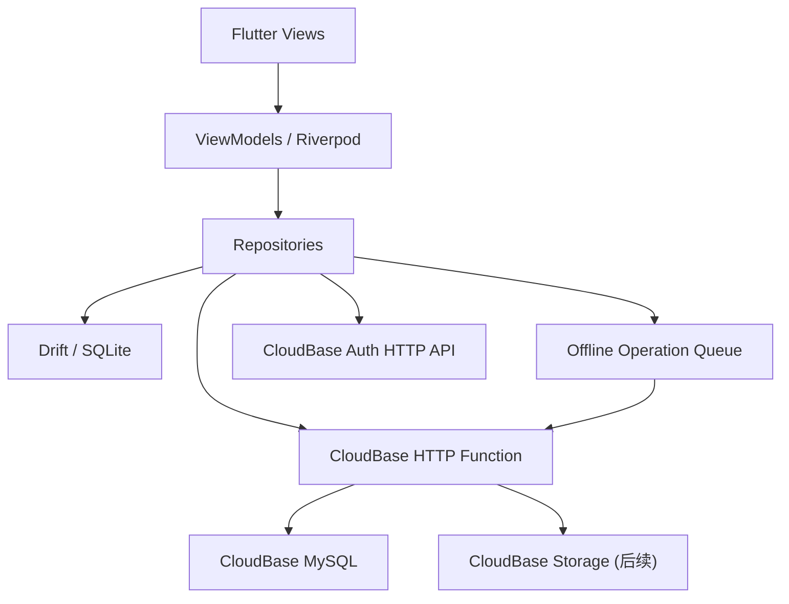

# 闯关小勇士 MVP 技术设计

> 状态：待技术方案确认  
> 版本：v0.1  
> 日期：2026-06-22  
> 需求基线：[requirements.md](requirements.md)

## 1. 技术决策摘要

客户端采用 **Flutter + Dart**，使用一套共享代码构建 Android 和 iOS App。

目标代码共享范围：

- 共享：页面、组件、动画、状态管理、业务规则、网络请求、数据模型、本地数据库和同步队列。
- 平台独立：应用签名、权限声明、图标、启动图、商店配置，以及未来必须调用原生 SDK 的少量桥接代码。
- MVP 预期 90% 以上客户端代码位于共享 Dart 工程中。

平台基线：

- Flutter：创建工程时使用当时的 stable 版本，并通过 FVM 固定项目版本。
- Android：最低 API 26。
- iOS：最低 iOS 13。
- 开发环境必须包含 macOS + Xcode，iOS 构建和签名不能只在 Windows/Linux 完成。

## 2. 跨端方案选择

| 方案 | 优点 | 代价 | 结论 |
|------|------|------|------|
| Flutter | UI 和业务高度共享；动画、绘制和儿童化界面能力强；Android/iOS 表现一致 | 团队需要使用 Dart；少量原生能力仍需插件或桥接 | **推荐** |
| React Native + Expo | TypeScript 生态成熟；适合已有 React 团队 | 复杂动画、原生依赖和离线数据库组合更依赖生态选型 | 不作为当前首选 |
| Kotlin Multiplatform + Compose Multiplatform | Kotlin 业务复用好；适合 Kotlin 团队 | iOS 工程、插件和发布链路的学习与维护成本更高 | 暂不选择 |

选择 Flutter 的主要原因：

- 当前没有需要继承的 Android 或 iOS 原生代码。
- 产品强调统一视觉、大量动效和后续小游戏。
- MVP 需要快速同时验证 Android 与 iOS，而不是先建设两套 UI。
- CloudBase 对原生移动端采用 HTTP API 边界，Flutter 可以直接通过标准 HTTPS 接入。

## 3. 总体架构



基本原则：

- Flutter 本地数据库是页面读取数据的直接来源。
- Repository 负责协调本地数据与远端数据。
- UI 不直接调用 CloudBase 或拼接 HTTP 请求。
- 星星、连续奖励、全完成奖励和勋章由服务端事务结算。
- App 先做本地乐观更新，服务端返回后再校准最终状态。

## 4. 客户端技术栈

| 能力 | 选型 | 用途 |
|------|------|------|
| 跨端框架 | Flutter / Dart | Android 与 iOS 共用 UI 和业务代码 |
| UI 体系 | Material 3 + 自定义 Design Tokens | 颜色、圆角、字号、间距和组件规范 |
| 状态管理与依赖注入 | Riverpod | 页面状态、Repository 和 Service 注入 |
| 路由 | go_router | 登录态路由、四 Tab、家长区和详情页 |
| 网络 | Dio | 拦截器、Token、超时、重试和统一错误映射 |
| 数据模型 | freezed + json_serializable | 不可变模型、JSON 序列化和联合状态 |
| 本地数据库 | Drift + SQLite | 档案、任务、打卡、资产快照和待同步队列 |
| 安全存储 | flutter_secure_storage | AccessToken、RefreshToken 等敏感会话数据 |
| 网络状态 | connectivity_plus | 网络变化提示；不能单独作为真实可联网判断 |
| 唯一操作 ID | uuid | 离线操作幂等键 |
| 动画 | Flutter Animation API + Lottie | 打卡、飞星、彩带和勋章反馈 |
| 音频 | 跨平台轻量音效插件 | 点击、成功和跳过音效 |
| 测试 | flutter_test + integration_test | 单元、Widget 和双端集成测试 |

依赖版本不在设计文档中写死。创建工程时选择兼容当前 Flutter stable 的版本并提交 lockfile。

## 5. 客户端工程结构

```text
apps/mobile/
├── android/
├── ios/
├── lib/
│   ├── app/
│   │   ├── app.dart
│   │   ├── router.dart
│   │   └── bootstrap.dart
│   ├── core/
│   │   ├── config/
│   │   ├── database/
│   │   ├── network/
│   │   ├── security/
│   │   ├── sync/
│   │   ├── theme/
│   │   └── widgets/
│   └── features/
│       ├── auth/
│       ├── child_profile/
│       ├── today_tasks/
│       ├── task_management/
│       ├── badges/
│       ├── parent_area/
│       ├── math_placeholder/
│       └── english_placeholder/
├── test/
└── integration_test/

services/api/
├── src/
│   ├── routes/
│   ├── services/
│   ├── repositories/
│   ├── middleware/
│   └── domain/
└── tests/

database/
├── migrations/
└── seeds/
```

每个 Flutter feature 内部使用：

```text
feature/
├── data/
├── domain/
└── presentation/
```

MVP 中简单查询可直接通过 Repository 完成；只有跨多个 Repository 或包含复杂规则的流程才创建 UseCase，避免过度分层。

## 6. 客户端模块设计

### 6.1 Auth

- 注册、登录、刷新会话、退出登录。
- 手机号仅作为 11 位用户名格式，不标记为已验证联系方式。
- Flutter 通过 CloudBase Auth HTTP API 的 `/auth/v1/signin` 获取 AccessToken 与 RefreshToken，通过 `/auth/v1/token` 刷新会话，通过 `/auth/v1/user/signout` 退出。
- CloudBase `/auth/v1/signup` 不支持未验证手机号的纯用户名/密码注册，因此 Flutter 调用受信任的 `/api/auth/register` HTTP Function，由函数通过 `CreateUser` 管控面 API 创建用户名/密码用户；客户端不接触 SecretId、SecretKey 或管理 API Key。
- Auth OpenAPI 使用 `https://<EnvId>.api.tcloudbasegateway.com`，自建 HTTP Function 使用 `https://<EnvId>.service.tcloudbase.com`，客户端必须分别配置。

### 6.2 Bootstrap

登录后调用一次聚合接口，返回：

- 当前孩子档案。
- 今日任务与打卡状态。
- 当前可用星星、累计星星和勋章统计。
- 今日小心心。
- 服务端日期、家庭时区和同步游标。

聚合接口减少首页启动时的多次网络往返。

### 6.3 Today Tasks

- 页面始终观察 Drift 中的今日任务视图。
- 点击完成、跳过或撤销后，先在本地事务中更新记录并写入同步队列。
- ViewModel 立即播放反馈动画。
- 同步完成后使用服务端返回的结算快照覆盖本地资产数据。

### 6.4 Parent Area

- ViewModel 记录点击时间窗口。
- 3 秒内连续点击头部区域 5 次进入家长区。
- 进入后台超过 5 分钟、重启或主动退出后关闭家长区。
- 状态只保存在内存，不持久化。
- 危险操作另行显示确认弹窗。

### 6.5 Learning Placeholders

- 数学和英语 Tab 只显示独立占位页。
- 不请求题库、音频或内容包。
- 不产生小心心消费。
- 保留后续 Feature 路由与模块目录，避免 Phase 2/3 重构主导航。

## 7. 离线优先与同步

### 7.1 本地表

MVP 客户端至少包含：

- `local_children`
- `local_habits`
- `local_habit_records`
- `local_asset_snapshots`
- `local_badges`
- `sync_operations`
- `sync_metadata`

### 7.2 待同步操作

每条 `sync_operations` 记录包含：

- `operation_id`：客户端 UUID，也是服务端幂等键。
- `operation_type`：完成、跳过、撤销或任务管理操作。
- `entity_id`
- `payload`
- `created_at`
- `attempt_count`
- `status`：pending / syncing / failed。
- `last_error`

### 7.3 同步触发

- App 启动并恢复登录态。
- App 从后台回到前台。
- 网络从不可用变为可用。
- 用户主动点击重试。
- 本地写操作完成后立即尝试。

iOS 和 Android 的后台执行都可能被系统限制，因此 MVP 不依赖后台任务在精确时间运行。小心心补满由服务端在请求今日数据时按日期计算，不要求客户端零点常驻。

### 7.4 冲突策略

- MVP 只允许修改当天打卡。
- 同一孩子、任务和日期在服务端保持唯一记录。
- 服务端以 `operation_id` 去重。
- 客户端按操作创建顺序上传。
- 服务端结算快照是星星、心心和勋章的最终真相。

## 8. CloudBase 后端设计

### 8.1 服务边界

- CloudBase Auth：负责账号和会话。
- CloudBase HTTP Function：负责业务 API、身份校验、事务和幂等结算。
- CloudBase MySQL：保存业务数据。
- CloudBase Storage：MVP 仅预留，Phase 2/3 再接内容资源。

客户端不直接修改以下数据：

- 星星余额和星星流水。
- 全完成奖励与连续奖励。
- 勋章发放。
- 小心心跨天补满。

### 8.2 HTTP Function

后端采用 Node.js + TypeScript，一个 MVP HTTP Function 对外提供版本化 REST API。

建议入口：

```text
POST   /v1/bootstrap
GET    /v1/tasks/today
POST   /v1/task-operations
GET    /v1/habits
POST   /v1/habits
PATCH  /v1/habits/{id}
DELETE /v1/habits/{id}
PATCH  /v1/habits/reorder
GET    /v1/badges
POST   /v1/parent/reset-child
```

`POST /v1/task-operations` 接收统一的完成、跳过和撤销操作，并在一个数据库事务中：

1. 验证当前用户是否拥有目标孩子和任务。
2. 根据 `operation_id` 检查是否已经处理。
3. 写入或更新当天打卡。
4. 结算普通任务星星。
5. 重新判断全完成奖励。
6. 判断连续 7 天奖励。
7. 判断任务勋章。
8. 返回今日任务和资产结算快照。

### 8.3 身份与权限

- Flutter 只保存用户 AccessToken / RefreshToken，不保存 API Key。
- 业务请求使用 `Authorization: Bearer <AccessToken>`。
- HTTP Function 必须验证调用者身份，并从可信身份中取得 `_openid`。
- 所有查询同时校验 `_openid` 与 `child_id`。
- 模板数据客户端只读。

## 9. 数据模型调整方向

正式建表前应同步修改数据库设计：

- `children.star_count` 拆为 `star_balance` 和 `star_total_earned`。
- `star_transactions` 增加唯一 `idempotency_key` 和 `transaction_type`。
- 增加每日奖励结算标识，保证全完成和连续奖励可以发放与撤回且不重复。
- `rewards.badge_cost` 改为 `star_cost`。
- `reward_redemptions.badge_cost` 改为 `star_cost`。
- `badge_templates` 与 `child_badges` 只保留任务成就用途。
- `child_settings` 增加家庭时区；小心心固定上限为 10。
- 数学、英语和内容包相关表保留设计，但不在 MVP 首次迁移中全部创建。

MVP 首次迁移只创建当前闭环所需核心表，后续阶段使用增量迁移。

## 10. 环境与配置

设置三个环境：

- `dev`：本地开发与联调。
- `staging`：内测和回归。
- `prod`：正式发布。

Flutter 使用 flavor 区分：

- CloudBase `EnvId`
- Auth API Base URL
- HTTP Function API Base URL
- 日志级别
- App 名称和 Bundle/Application ID 后缀

所有环境必须显式配置完整 `EnvId`，不得依赖隐式当前环境。

## 11. 测试策略

### 客户端

- Domain/Repository 单元测试。
- ViewModel 状态测试。
- 登录、任务列表、打卡和家长入口 Widget 测试。
- Drift migration 与同步队列测试。
- Android/iOS 真机集成测试。

### 后端

- 星星结算与撤销单元测试。
- 全完成和连续 7 天边界测试。
- `operation_id` 重放测试。
- 越权读取和修改测试。
- MySQL 事务回滚测试。

### 必测场景

- 离线完成任务后重复联网。
- 连续快速点击完成/撤销。
- 当天最后一个任务完成与撤销。
- 第 7 天奖励重复请求。
- 修改设备时间跨天。
- App 在同步中被杀死后重启。

## 12. 发布与持续集成

- 每次提交执行 Dart format、analyze、单元测试和 Widget 测试。
- Android 构建 APK/AAB，iOS 构建 Simulator 包并在发布分支生成 Archive。
- iOS 真机和 App Store 发布需要 Apple Developer 账号、证书和 Provisioning Profile。
- Android/iOS 商店元数据、隐私清单和截图分别维护。
- 后端和数据库迁移先部署到 staging，通过双端回归后再进入 prod。

## 13. 风险与实施门槛

1. CloudBase 原生端用户名/密码 Auth HTTP API 必须在编码前通过官方 OpenAPI 验证。
2. 连续点击 5 次不是安全认证，只适用于 MVP 儿童误触隔离。
3. iOS 后台同步不可保证精确执行，所有跨天规则必须由服务端惰性结算。
4. 当前数据库文档仍按 Android/旧资产规则描述，必须在建表前同步。
5. Flutter 插件必须逐一验证 Android API 26 与 iOS 13 的支持情况。

## 14. 下一阶段输出

技术设计确认后创建 `tasks.md`，按以下实施批次拆解：

1. Flutter 双端工程与基础架构。
2. CloudBase 环境、Auth 和核心 MySQL 迁移。
3. 登录注册与孩子初始化。
4. 今日任务和离线同步。
5. 星星、连续奖励和勋章结算。
6. 家长区与任务管理。
7. Android/iOS 双端测试和内测发布。
